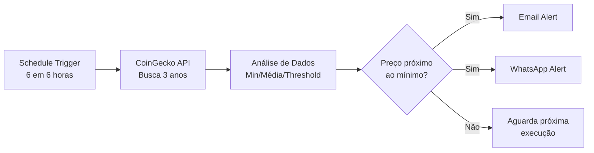

# 🚨 Bitcoin Price Monitor - n8n Workflow

[](https://n8n.io)
[](https://bitcoin.org)
[](LICENSE)

> Workflow automatizado em n8n que monitora o preço do Bitcoin e envia alertas quando o preço se aproxima do mínimo histórico dos últimos 3 anos.


---

## 📋 Índice

- [Sobre o Projeto](#-sobre-o-projeto)
- [Funcionalidades](#-funcionalidades)
- [Como Funciona](#-como-funciona)
- [Instalação](#-instalação)
- [Configuração](#-configuração)
- [Uso](#-uso)
- [Personalização](#-personalização)
- [Tecnologias](#-tecnologias)
- [Troubleshooting](#-troubleshooting)
- [Contribuindo](#-contribuindo)
- [Licença](#-licença)

---

## 🎯 Sobre o Projeto

Este workflow foi desenvolvido para investidores e entusiastas de Bitcoin que desejam ser notificados automaticamente quando o preço da criptomoeda atinge valores próximos aos mínimos históricos dos últimos 3 anos.

O sistema analisa 1.095 dias de histórico de preços e envia alertas por **Email** e **WhatsApp** quando o Bitcoin está **10% ou menos acima do valor mínimo** registrado no período, indicando uma potencial oportunidade de compra.

### 💡 Por que usar?

- ✅ **Automatização completa** - Não precisa ficar verificando preços manualmente
- ✅ **Análise técnica robusta** - Baseada em 3 anos de dados históricos
- ✅ **Notificações múltiplas** - Email + WhatsApp para você não perder nenhum alerta
- ✅ **Totalmente gratuito** - Usa APIs gratuitas (CoinGecko + CallMeBot)
- ✅ **Código aberto** - 100% customizável para suas necessidades

---

## 🚀 Funcionalidades

- 📊 **Análise de 3 anos** de histórico de preços do Bitcoin
- 📉 Cálculo automático de **preço mínimo** e **preço médio** do período
- 🎯 Threshold configurável para definir proximidade do mínimo (padrão: 10%)
- 📧 **Notificação por Email** com formatação HTML profissional
- 📱 **Notificação por WhatsApp** via CallMeBot API
- ⏰ Execução agendada a cada **6 horas** (configurável)
- 🔔 Alertas somente quando condições são atendidas (sem spam)
- 📈 Informações detalhadas: preço atual, mínimo, média e % acima do mínimo

---

## 🔄 Como Funciona



### Fluxo Detalhado:

1. **Schedule Trigger**: Workflow executa automaticamente a cada 6 horas
2. **API Request**: Busca histórico de 1.095 dias (3 anos) via CoinGecko
3. **Análise**: Calcula mínimo, média e verifica proximidade do threshold
4. **Decisão**: Se preço <= threshold (mínimo + 10%), envia alertas
5. **Notificação**: Email e WhatsApp são enviados simultaneamente
6. **Loop**: Aguarda próximo ciclo de 6 horas

---

## 📦 Instalação

### Pré-requisitos

- [n8n](https://n8n.io) instalado (self-hosted ou cloud)
- Conta Gmail (para SMTP) ou outro provedor de email
- WhatsApp ativo (para notificações via CallMeBot)

### Passos

1. **Clone este repositório:**
   ```bash
   git clone https://github.com/seu-usuario/bitcoin-price-monitor-n8n.git
   cd bitcoin-price-monitor-n8n
   ```

2. **Abra o n8n:**
   ```bash
   n8n start
   # ou acesse sua instância cloud
   ```

3. **Importe o workflow:**
   - No n8n, clique em **Menu** → **Import from File**
   - Selecione o arquivo `bitcoin_monitor_workflow.json`
   - Clique em **Import**

---

## ⚙️ Configuração

### 1. Configurar Email (Gmail SMTP)

#### Criar Senha de App no Gmail:

1. Acesse: https://myaccount.google.com/security
2. Ative **Verificação em 2 etapas**
3. Vá em **Senhas de app**
4. Selecione **Email** → **Outro dispositivo**
5. Copie a senha de 16 dígitos

#### Configurar no n8n:

No nó **"Send Email Alert"**:
- **Host:** `smtp.gmail.com`
- **Port:** `587`
- **Secure:** `false` (usa STARTTLS)
- **From Email:** `seu-email@gmail.com`
- **To Email:** `email-destino@gmail.com`
- **Username:** `seu-email@gmail.com`
- **Password:** `senha-de-app-16-digitos`

### 2. Configurar WhatsApp (CallMeBot)

#### Ativar CallMeBot:

1. Adicione o número **+34 644 34 76 64** aos contatos
2. Envie via WhatsApp: `I allow callmebot to send me messages`
3. Você receberá sua **API Key**

#### Configurar no n8n:

No nó **"Send WhatsApp Alert"**, edite os parâmetros da URL:
- **phone:** `+5511999999999` (seu número com código do país)
- **apikey:** `SUA_API_KEY_RECEBIDA`

---

## 🎮 Uso

### Executar Manualmente (Teste)

1. Abra o workflow no n8n
2. Clique em **"Execute Workflow"**
3. Aguarde a execução completar
4. Verifique se recebeu as notificações

### Ativar Execução Automática

1. No topo do workflow, ative o **toggle** (deve ficar verde)
2. O workflow agora executará automaticamente a cada 6 horas
3. Monitore os logs em **Executions** para verificar o funcionamento

### Exemplo de Alerta Recebido

**Email:**
```
🚨 Alerta de Preço do Bitcoin

O Bitcoin está se aproximando do valor mínimo dos últimos 3 anos!

┌─────────────────────┬──────────────┐
│ Preço Atual:        │ $42,350.00   │
│ Mínimo (3 anos):    │ $38,500.00   │
│ Média (3 anos):     │ $52,780.00   │
│ % Acima do Mínimo:  │ 10.00%       │
└─────────────────────┴──────────────┘

⚠️ Ação Recomendada: Este pode ser um bom momento 
para considerar uma entrada ou acumulação.
```

**WhatsApp:**
```
🚨 ALERTA: Bitcoin está 10.00% acima do mínimo de 3 anos!

Preço Atual: $42,350.00
Mínimo 3 anos: $38,500.00
Média 3 anos: $52,780.00

2025-01-14T15:30:00.000Z
```

---

## 🎨 Personalização

### Alterar Threshold de Alerta

No nó **"Analyze Price Data"**, linha 15:

```javascript
// Padrão: 10% acima do mínimo
const threshold = minPrice * 1.10;

// Opções:
const threshold = minPrice * 1.05; // 5% acima (mais sensível)
const threshold = minPrice * 1.15; // 15% acima (menos sensível)
const threshold = minPrice * 1.20; // 20% acima
```

### Alterar Frequência de Execução

No nó **"Schedule Trigger"**:

```javascript
// A cada 1 hora
"hoursInterval": 1

// A cada 3 horas
"hoursInterval": 3

// A cada 12 horas
"hoursInterval": 12

// Uma vez por dia
"hoursInterval": 24
```

### Alterar Período de Análise

No nó **"Get 3 Year Bitcoin History"**, parâmetro `days`:

```javascript
"days": "1095"  // 3 anos (padrão)
"days": "730"   // 2 anos
"days": "1825"  // 5 anos
```

### Adicionar Outras Criptomoedas

Modifique a URL da API para outras moedas:

```javascript
// Ethereum
"url": "https://api.coingecko.com/api/v3/coins/ethereum/market_chart"

// Solana
"url": "https://api.coingecko.com/api/v3/coins/solana/market_chart"
```

---

## 🛠️ Tecnologias

| Ferramenta | Descrição | Link |
|------------|-----------|------|
|  | Plataforma de automação workflow | [n8n.io](https://n8n.io) |
|  | API de dados de criptomoedas | [coingecko.com](https://coingecko.com) |
|  | API WhatsApp gratuita | [callmebot.com](https://callmebot.com) |
|  | Serviço SMTP para emails | [gmail.com](https://gmail.com) |

---

## 🐛 Troubleshooting

### Email não chega

**Problema:** Email não é recebido após execução.

**Soluções:**
- ✅ Verifique se a **senha de app** do Gmail está correta
- ✅ Confirme que **verificação em 2 etapas** está ativa
- ✅ Verifique a **pasta de spam**
- ✅ Tente usar **port 465** com `secure: true`
- ✅ Verifique os logs de execução no n8n

### WhatsApp não funciona

**Problema:** Mensagem não chega no WhatsApp.

**Soluções:**
- ✅ Confirme que enviou `I allow callmebot to send me messages`
- ✅ Verifique se o número está no formato correto: `+5511999999999`
- ✅ Aguarde alguns minutos (pode haver delay de até 5 min)
- ✅ Teste a URL manualmente no navegador
- ✅ Verifique se a API Key está correta

### Workflow não executa automaticamente

**Problema:** Workflow não roda no horário agendado.

**Soluções:**
- ✅ Certifique-se de que o **toggle está ATIVO** (verde)
- ✅ Verifique se o n8n está rodando continuamente
- ✅ Confirme o timezone do servidor
- ✅ Verifique os logs em **Executions**

### Erro na API CoinGecko

**Problema:** Erro ao buscar dados históricos.

**Soluções:**
- ✅ Verifique sua conexão com internet
- ✅ CoinGecko tem rate limit - use intervalos >= 6 horas
- ✅ Verifique se a API está online: https://status.coingecko.com
- ✅ Considere usar API Key paga para limites maiores

---

## 🤝 Contribuindo

Contribuições são bem-vindas! Siga estes passos:

1. **Fork** o projeto
2. Crie uma **branch** para sua feature (`git checkout -b feature/MinhaFeature`)
3. **Commit** suas mudanças (`git commit -m 'Adiciona MinhaFeature'`)
4. **Push** para a branch (`git push origin feature/MinhaFeature`)
5. Abra um **Pull Request**

### Ideias de Melhorias

- [ ] Suporte para múltiplas criptomoedas simultaneamente
- [ ] Dashboard web para visualizar histórico de alertas
- [ ] Integração com Telegram
- [ ] Análise técnica adicional (RSI, MACD, Bollinger Bands)
- [ ] Notificações por SMS
- [ ] Machine Learning para prever tendências
- [ ] Armazenamento de dados em banco de dados
- [ ] Gráficos interativos com histórico

---

## 📄 Licença

Este projeto está sob a licença **MIT**. Veja o arquivo [LICENSE](LICENSE) para mais detalhes.

```
MIT License

Copyright (c) 2025

Permission is hereby granted, free of charge, to any person obtaining a copy
of this software and associated documentation files...
```

---

## 👤 Autor

**Seu Nome**

- GitHub: https://github.com/Victorvillela
- LinkedIn: https://www.linkedin.com/in/jvictorvillela/
- Email: victormolicovillela@hotmail.com

---

## ⭐ Mostre seu apoio

Se este projeto foi útil para você, considere dar uma ⭐️!

---

## 📞 Contato

Tem dúvidas ou sugestões?

---

<div align="center">

**[⬆ Voltar ao topo](#-bitcoin-price-monitor---n8n-workflow)**

Feito com ❤️ e ☕ | Powered by n8n

</div>
